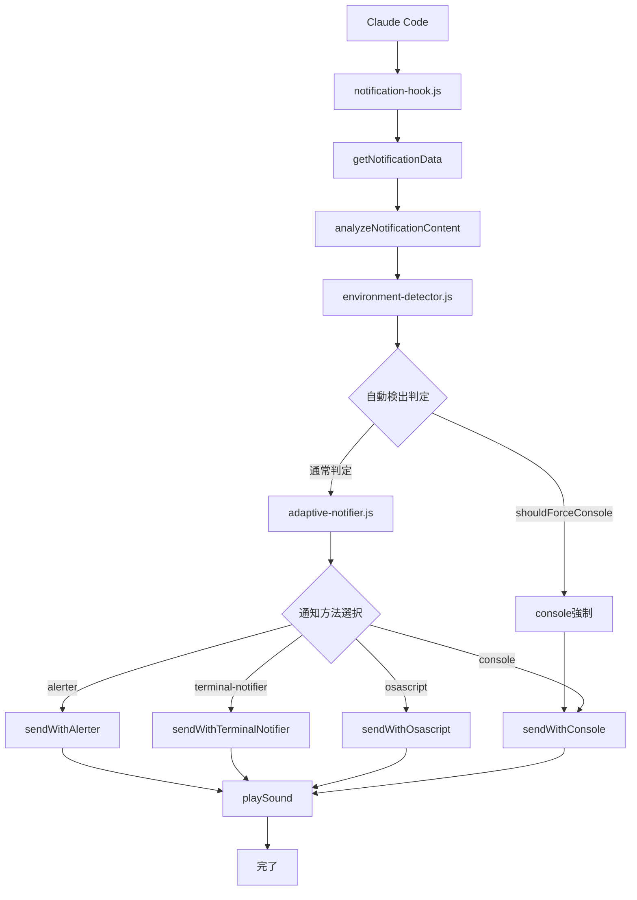
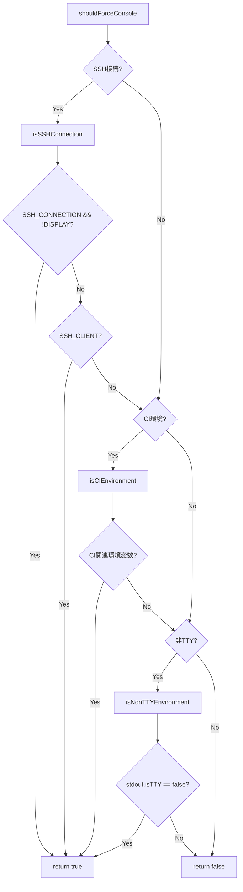

# 🏗️ cat-ccnotify-hook システムアーキテクチャ

## 📋 概要

cat-ccnotify-hookは、Claude Codeの通知システムを猫の鳴き声と共に美しく拡張するNode.jsアプリケーションです。このドキュメントは、システムの内部構造とコンポーネント間の相互作用を詳しく解説します。

## 🎯 設計原則

### 1. 適応性 (Adaptability)
- 様々な端末環境に自動適応
- 利用可能な通知方法の自動検出
- 段階的フォールバック機能
- **自動環境検出による透明な動作**

### 2. 拡張性 (Extensibility)
- モジュール化された設計
- 新しい通知方法の追加が容易
- 環境変数による動的設定
- **新しい環境検出ロジックの追加が容易**

### 3. 堅牢性 (Robustness)
- 包括的エラーハンドリング
- 複数の入力ソースに対応
- 安全なシェル実行
- **自動検出失敗時の適切なフォールバック**

## 🏛️ システム構成

### レイヤー構造
```
┌─────────────────────────────────────────────────────┐
│                 Interface Layer                      │
│  ┌─────────────┐  ┌─────────────┐  ┌─────────────┐ │
│  │notification-│  │  stop-hook  │  │ cat-notify  │ │
│  │   hook.js   │  │    .cjs     │  │  (bin)      │ │
│  └─────────────┘  └─────────────┘  └─────────────┘ │
└─────────────────────────────────────────────────────┘
                            │
┌─────────────────────────────────────────────────────┐
│                 Business Layer                       │
│  ┌─────────────┐  ┌─────────────┐  ┌─────────────┐ │
│  │ adaptive-   │  │environment- │  │notification-│ │
│  │ notifier.js │  │detector.js  │  │ sender.js   │ │
│  └─────────────┘  └─────────────┘  └─────────────┘ │
└─────────────────────────────────────────────────────┘
                            │
┌─────────────────────────────────────────────────────┐
│                Infrastructure Layer                  │
│  ┌─────────────┐  ┌─────────────┐  ┌─────────────┐ │
│  │shell-       │  │error-       │  │parent-app-  │ │
│  │executor.js  │  │handler.js   │  │detector.js  │ │
│  └─────────────┘  └─────────────┘  └─────────────┘ │
└─────────────────────────────────────────────────────┘
```

## 🔧 コアコンポーネント

### 1. Notification Hook (Interface Layer)
**ファイル**: `hooks/notification-hook.js`
**役割**: Claude Codeからの通知の受信と処理

#### 主要機能
- 多様な入力ソースからの通知データ取得
- 通知内容の解析と分類
- 適応的通知システムの呼び出し

#### データフロー
```javascript
// 入力ソースの優先順位
function getNotificationData() {
  // 1. 環境変数
  const envData = getEnvironmentVariables();
  if (envData.isValid) return envData;
  
  // 2. 標準入力 (JSON/Plain Text)
  const stdinData = parseStandardInput();
  if (stdinData.isValid) return stdinData;
  
  // 3. コマンドライン引数
  const argsData = parseCommandLineArguments();
  if (argsData.isValid) return argsData;
  
  // 4. デフォルト値
  return getDefaultNotification();
}
```

#### 通知分類システム
```javascript
// 通知内容の自動分類
function analyzeNotificationContent(title, message) {
  const content = `${title} ${message}`.toLowerCase();
  
  const patterns = {
    error: [/error/i, /failed/i, /crash/i],
    success: [/complete/i, /success/i, /passed/i],
    warning: [/warning/i, /caution/i, /deprecated/i],
    // ... 他のパターン
  };
  
  for (const [category, categoryPatterns] of Object.entries(patterns)) {
    if (categoryPatterns.some(pattern => pattern.test(content))) {
      return category;
    }
  }
  
  return 'info';
}
```

### 2. Environment Detector (Business Layer)
**ファイル**: `lib/environment-detector.js`
**役割**: 実行環境の検出と最適化

#### 検出項目
```javascript
class EnvironmentDetector {
  detectTerminalEnvironment() {
    return {
      // 基本情報
      term: process.env.TERM,
      termProgram: process.env.TERM_PROGRAM,
      platform: process.platform,
      
      // 機能サポート
      supportsColor: this.detectColorSupport(),
      supportsNotifications: this.detectNotificationSupport(),
      
      // 特定端末
      isITerm2: process.env.TERM_PROGRAM === 'iTerm.app',
      isVSCode: process.env.TERM_PROGRAM === 'vscode',
      
      // 親アプリケーション
      parentApp: this.detectParentApp()
    };
  }
}
```

#### 通知能力の検出
```javascript
detectNotificationCapabilities() {
  const capabilities = {
    hasOsascript: this.commandExists('osascript'),
    hasTerminalNotifier: this.commandExists('terminal-notifier'),
    hasAlerter: this.commandExists('alerter'),
    hasAfplay: this.commandExists('afplay')
  };
  
  return {
    ...capabilities,
    bestNotificationMethod: this.getBestNotificationMethod(capabilities),
    bestSoundMethod: this.getBestSoundMethod(capabilities)
  };
}

// 自動検出機能の追加
shouldForceConsole() {
  // SSH接続時（DISPLAYが設定されていない場合）
  if (this.isSSHConnection()) {
    return true;
  }
  
  // CI環境
  if (this.isCIEnvironment()) {
    return true;
  }
  
  // 非TTY環境（パイプやリダイレクト）
  if (this.isNonTTYEnvironment()) {
    return true;
  }
  
  return false;
}
```
```

### 3. Adaptive Notifier (Business Layer)
**ファイル**: `lib/adaptive-notifier.js`
**役割**: 環境に応じた通知の実行

#### 通知方法の優先順位（自動検出対応）
```javascript
async sendNotification(title, message, options = {}) {
  const method = this.env.notificationCapabilities.bestNotificationMethod;
  
  // iTerm2の場合、専用のESCシーケンスを優先（ただし自動検出の結果がconsoleでない場合のみ）
  if (this.env.terminalInfo.isITerm2 && method !== 'console') {
    return await this.sendWithITerm2EscSequence(title, message, options);
  }
  
  switch (method) {
    case 'alerter':
      return await this.sendWithAlerter(title, message, options);
    case 'terminal-notifier':
      return await this.sendWithTerminalNotifier(title, message, options);
    case 'osascript':
      return await this.sendWithOsascript(title, message, options);
    case 'console':
      return await this.sendWithConsole(title, message, options);
    default:
      return await this.sendWithConsole(title, message, options);
  }
}

// environment-detector.js での判定ロジック
getBestNotificationMethod(capabilities) {
  // 1. 環境変数による強制設定（最優先）
  if (process.env.CAT_CCNOTIFY_FORCE_CONSOLE === 'true') {
    return 'console';
  }
  
  // 2. 自動検出：明確にコンソール出力が適切な環境
  if (this.shouldForceConsole()) {
    return 'console';
  }
  
  // 3. 通常の通知方法選択
  if (this.platform === 'darwin') {
    if (capabilities.hasAlerter) return 'alerter';
    if (capabilities.hasTerminalNotifier) return 'terminal-notifier';
    if (capabilities.hasOsascript) return 'osascript';
  }
  
  // 4. フォールバック
  return 'console';
}
```
```

#### 通知方法の実装
```javascript
// macOS Alerter通知
async sendWithAlerter(title, message, parentApp, options) {
  const args = ['-title', title, '-message', message, '-timeout', '10'];
  
  if (parentApp.bundleId) {
    args.push('-actions', 'Focus Terminal');
  }
  
  return new Promise((resolve) => {
    const alerter = spawn('alerter', args);
    
    alerter.on('close', (code) => {
      resolve({
        success: code === 0,
        method: 'alerter',
        interactive: true
      });
    });
    
    this.playSound();
  });
}
```

### 4. Shell Executor (Infrastructure Layer)
**ファイル**: `lib/shell-executor.js`
**役割**: 安全なシェルコマンドの実行

#### セキュリティ機能
```javascript
export function sanitizeNotificationContent(content) {
  if (!content || typeof content !== 'string') {
    return '';
  }
  
  return content
    .replace(/[<>&"'`$\\]/g, '') // 危険な文字を除去
    .substring(0, 1000) // 長さ制限
    .trim();
}

export function escapeAppleScript(text) {
  return text
    .replace(/\\/g, '\\\\')
    .replace(/"/g, '\\"')
    .replace(/\n/g, '\\n');
}
```

#### 実行関数
```javascript
export async function executeOsascript(script) {
  try {
    const result = await execAsync(`osascript -e "${script}"`);
    return { success: true, output: result.stdout };
  } catch (error) {
    throw new NotificationError(
      'AppleScript execution failed',
      ErrorCodes.APPLESCRIPT_FAILED,
      error
    );
  }
}
```

### 5. Error Handler (Infrastructure Layer)
**ファイル**: `lib/error-handler.js`
**役割**: 統一的なエラー処理

#### エラー分類
```javascript
export const ErrorCodes = {
  NOTIFICATION_FAILED: 'NOTIFICATION_FAILED',
  APPLESCRIPT_FAILED: 'APPLESCRIPT_FAILED',
  AUDIO_PLAYBACK_FAILED: 'AUDIO_PLAYBACK_FAILED',
  FILE_NOT_FOUND: 'FILE_NOT_FOUND',
  PERMISSION_DENIED: 'PERMISSION_DENIED',
  SYSTEM_ERROR: 'SYSTEM_ERROR'
};
```

#### エラーハンドリング戦略
```javascript
export function handleError(error, context = {}) {
  const errorReport = createErrorReport(error, context);
  
  // ログ記録
  logError(errorReport);
  
  // フォールバック実行
  if (context.fallbackAction) {
    try {
      context.fallbackAction();
    } catch (fallbackError) {
      logError(createErrorReport(fallbackError, { operation: 'fallback' }));
    }
  }
  
  // ユーザー通知
  if (context.shouldNotifyUser) {
    notifyUserOfError(error);
  }
}
```

## 🔄 処理フロー

### 通知処理の完全フロー（自動検出対応）


#### 自動検出の判定フロー


### データ変換フロー
```javascript
// 入力データの変換パイプライン
rawInput
  → parseInput()
  → validateInput()
  → sanitizeContent()
  → analyzeContent()
  → enhanceNotification()
  → sendNotification()
```

## 🧪 テスト戦略

### 1. 単体テスト
```javascript
// 各コンポーネントの独立テスト
describe('EnvironmentDetector', () => {
  it('should detect terminal capabilities', () => {
    const detector = new EnvironmentDetector();
    const capabilities = detector.detectNotificationCapabilities();
    
    expect(capabilities).toHaveProperty('bestNotificationMethod');
    expect(capabilities.bestNotificationMethod).toBeDefined();
  });
});

// 自動検出機能のテスト
describe('Auto Detection', () => {
  it('should detect SSH connection', () => {
    process.env.SSH_CONNECTION = '192.168.1.100 54321 192.168.1.1 22';
    const detector = new EnvironmentDetector();
    
    expect(detector.isSSHConnection()).toBe(true);
    expect(detector.shouldForceConsole()).toBe(true);
  });
  
  it('should detect CI environment', () => {
    process.env.CI = 'true';
    const detector = new EnvironmentDetector();
    
    expect(detector.isCIEnvironment()).toBe(true);
    expect(detector.shouldForceConsole()).toBe(true);
  });
  
  it('should detect non-TTY environment', () => {
    process.stdout.isTTY = false;
    const detector = new EnvironmentDetector();
    
    expect(detector.isNonTTYEnvironment()).toBe(true);
    expect(detector.shouldForceConsole()).toBe(true);
  });
});
```

### 2. 統合テスト
```javascript
// コンポーネント間の相互作用テスト
describe('AdaptiveNotifier Integration', () => {
  it('should send notification using detected method', async () => {
    const detector = new EnvironmentDetector();
    const notifier = new AdaptiveNotifier(detector);
    
    const result = await notifier.sendNotification('Test', 'Message');
    expect(result.success).toBe(true);
  });
});
```

### 3. E2Eテスト
```javascript
// 完全なワークフローテスト
describe('Complete Notification Flow', () => {
  it('should process notification end-to-end', (done) => {
    exec('node hooks/notification-hook.js "Test" "E2E Test"', (error, stdout) => {
      expect(error).toBeNull();
      expect(stdout).toContain('Test');
      done();
    });
  });
});
```

## 🔧 設定と拡張

### カスタマイズポイント

#### 1. 新しい通知方法の追加
```javascript
// lib/adaptive-notifier.js
class AdaptiveNotifier {
  async sendWithCustomMethod(title, message, options) {
    // カスタム通知実装
    const result = await customNotificationAPI(title, message);
    
    return {
      success: result.ok,
      method: 'custom',
      metadata: result.metadata
    };
  }
}
```

#### 2. 新しい環境検出の追加
```javascript
// lib/environment-detector.js
class EnvironmentDetector {
  detectCustomEnvironment() {
    return {
      hasCustomTool: this.commandExists('custom-tool'),
      customSetting: process.env.CUSTOM_SETTING,
      // ... 他の検出項目
    };
  }
  
  // 新しい自動検出条件の追加
  isDockerEnvironment() {
    return fs.existsSync('/.dockerenv') || 
           process.env.DOCKER_CONTAINER === 'true';
  }
  
  isWSLEnvironment() {
    return process.env.WSL_DISTRO_NAME !== undefined ||
           fs.existsSync('/proc/version') && 
           fs.readFileSync('/proc/version', 'utf8').includes('Microsoft');
  }
  
  shouldForceConsole() {
    // 既存の条件...
    if (this.isSSHConnection() || this.isCIEnvironment() || this.isNonTTYEnvironment()) {
      return true;
    }
    
    // 新しい条件の追加
    if (this.isDockerEnvironment()) {
      return true;
    }
    
    if (this.isWSLEnvironment() && !this.hasWindowsNotificationSupport()) {
      return true;
    }
    
    return false;
  }
}
```

#### 3. 新しいエラータイプの追加
```javascript
// lib/error-handler.js
export const ErrorCodes = {
  // 既存のエラーコード...
  CUSTOM_ERROR: 'CUSTOM_ERROR',
  NETWORK_ERROR: 'NETWORK_ERROR'
};
```

## 🚀 パフォーマンス最適化

### 1. 遅延読み込み
```javascript
// 必要時にのみモジュールを読み込み
class LazyNotifier {
  async getNotificationMethod() {
    if (!this.notificationMethod) {
      const { AdaptiveNotifier } = await import('./adaptive-notifier.js');
      this.notificationMethod = new AdaptiveNotifier();
    }
    return this.notificationMethod;
  }
}
```

### 2. キャッシュ機能
```javascript
// 環境検出結果のキャッシュ
class CachedEnvironmentDetector {
  constructor() {
    this.cache = new Map();
    this.cacheTimeout = 5 * 60 * 1000; // 5分
  }
  
  detectCapabilities() {
    const cached = this.cache.get('capabilities');
    if (cached && Date.now() - cached.timestamp < this.cacheTimeout) {
      return cached.data;
    }
    
    const capabilities = this.performDetection();
    this.cache.set('capabilities', {
      data: capabilities,
      timestamp: Date.now()
    });
    
    return capabilities;
  }
}
```

## 🔒 セキュリティ考慮事項

### 1. 入力検証
```javascript
function validateNotificationInput(input) {
  if (!input || typeof input !== 'string') {
    throw new ValidationError('Invalid input type');
  }
  
  if (input.length > 5000) {
    throw new ValidationError('Input too long');
  }
  
  if (containsMaliciousContent(input)) {
    throw new SecurityError('Malicious content detected');
  }
  
  return true;
}
```

### 2. コマンドインジェクション防止
```javascript
function sanitizeShellCommand(command) {
  // 危険な文字の除去
  const sanitized = command.replace(/[;&|`$(){}[\]]/g, '');
  
  // ホワイトリスト検証
  if (!allowedCommandPattern.test(sanitized)) {
    throw new SecurityError('Command not allowed');
  }
  
  return sanitized;
}
```

---

このアーキテクチャドキュメントは、cat-ccnotify-hookシステムの内部構造を理解し、効果的に開発・保守するための包括的なガイドです。各コンポーネントの役割と相互作用を把握することで、安全で効率的な拡張が可能になります。